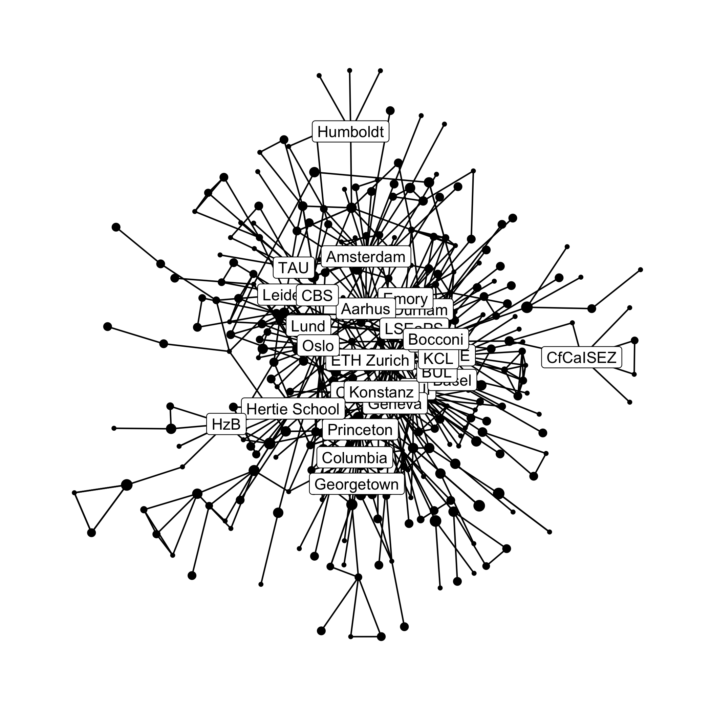

Main project repository: [`briatte/epsaconf`](https://github.com/briatte/epsaconf)

Co-authorship ties between academic organizations, based on papers presented at the [European Political Science Association](https://www.epsanet.org/) (EPSA) 2022 conference:

This is basically the same project as [this repository](https://github.com/briatte/epsa2021), using [2022 data](https://coms.events/epsa-2022/en/), and in even more draft stage.
